# Chikitsa - A Complete end to end Clinic Automation System🏆

This is .NET based Web Application using ASP.NET (MVC) framework

"Chikitsa" is a CAS (Clinic Automation system). It is a .NET based web application and it provides an important customer interface to the Clinic operations. Prior to this system a lot of processes we handled manually and consumed a lot of time and resources. Based on the requirements this system has bee designed to enable users to have easy access to the common information about the clinic. Using this, users will now be able to search for more information on the prescribed drugs. Patients will be able to interact with their physicians directly via an inbuilt messaging system. The system also has the provision for physicians and salespersons to order for more drugs directly with the suppliers. Suppliers in turn can view the orders placed in the system and approve it as well. In short it supports a part of the information infrastructure and workflow management to support the day to day activities of a clinic. Based on the various surveys conducted prior to using this system, it will now allow a majority of information to be available for patients online thus reducing the intake of telephonic queries at the clinic. It also forms a common platform for Physicians, Patients, Suppliers and Salesperson to perform their tasks efficiently and faster.

## Tech Stack ❄️

**Client:** -  HTML, CSS, Bootstrap, AJAX 🧑‍💻

**Server:** -   C#, .NET,  ASP.NET MVC Framework, Entity Framework 🧑‍💻

**Database:** -   SQL Server 🧑‍💻

**IDE:** -  Visual Studio 2023, Microsoft SQL Server Management Studio 🧑‍💻

## About Project 🚧
“Chikitsa” is a Microsoft .NET based web application and provides a common platform for the different users responsible for the smooth operations of the clinic. This system supports six different types of users: Guests, Admin, Patients, Physicians, Salesperson and Suppliers.

The Guest User can only view the drugs inventory and the physicians associated with the clinic; as well as request the admin for their registration along with a particular role of - Patient, Physician, or Supplier. Salesperson are directly appointed by the clinic and thus cannot be requested as a role.

Each and every registered user can edit their personal details which are different according to their role. They can also change their password.

The Admin User can view these requests and can accept or deny them. They can register the users for specific roles and an e-mail is sent to the registered e-mail address along with a random generated numerical password. The admin can access the information of all the users and can block them. They can also delete the drugs from the inventory. The drugs are "deleted" in the sense that they will not be visible to the patients for ordering but they will be retained in the database for the sole purpose of not having to enter quite the same data repeatedly.

The Patient User can request the physicians for an appointment. The Specialization of the Physician must be selected first. With the help of AJAX, physicians associated with that particular specialization are loaded. A failure to do this, results in an error. The Appoitments and their status can be viewed. Also, the patients can order drugs from the clinic and can view the order and its status. The patient can also send a message to the physician but only after their appointment has been accepted. They can then view the subject line to the message and further replies in the "View Messages" page.

The Physician User can view the requested appointments and accept or reject them. They can view and update the medical history of those patients who currently have their appointment or are done with it. They can reply to the messages sent by the patients and also send new messages to the salesperson, mainly regarding the availability of drugs in the clinic. They can then view the subject line to the message and further replies in the "View Messages" page.

The Salesperson User can add new drugs to the drug inventory and can view those drugs while also being able to edit the drug information and delete the drug from inventory. They manage the drug orders raised by the patient and can deliver or reject them. They can also place new orders to the supplier for stocking up the inventory and view the status of the placed orders. They can reply to the messages sent by the physicians and also send new messages to the supplier, mainly regarding the availability of drugs in the clinic. They can then view the subject line to the message and further replies in the "View Messages" page.

The Supplier User manages the drug orders raised by the salesperson and can deliver or reject them. They can reply to the messages sent by the salesperson.


## Required Functionality ⌛

 -  All users can view drugs inventory and active physicians
-   Guest can request admin for registration
-   Registered Users can login
-   All users can edit their personal details
-   All users can change their password

### For Admin: 🧨
-   Admin can register and block users
-   Admin can delete drugs from drugs inventory

### For Patient: 🧨
-   Patient can request appointment from physician
-   Patient can order drugs from drugs inventory
-   Patient can send messages to physician

### For Physician: 🧨
-   Physician can accept/reject requested appointments
-   Physician can update patients' history
-   Physician can send messages to salesperson
-   Physician can reply to patients' messages

### For Salesperson: 🧨
-   Salesperson can add drugs to the drugs inventory
-   Salesperson can edit/delete drugs from the drugs inventory
-   Salesperson can deliver/reject orders raised by patients
-   Salesperson can order drugs from supplier
-   Salesperson can send messages to supplier
-   Salesperson can reply to physicians' messages

### For Supplier: 🧨
-   Supplier can deliver/reject orders raised by salespersons
-   Supplier can reply to salespersons' messages

## Screenshots🔥
`Home page`
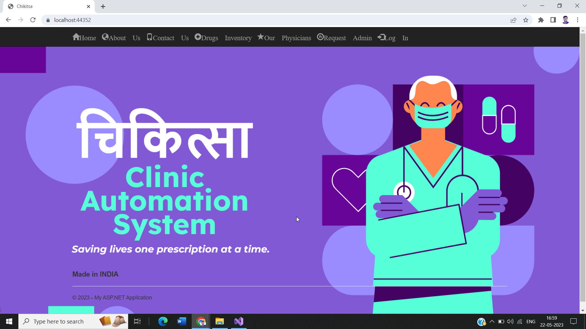

`Guest view Drugs Inventory page`


`Guest view Physician Page`
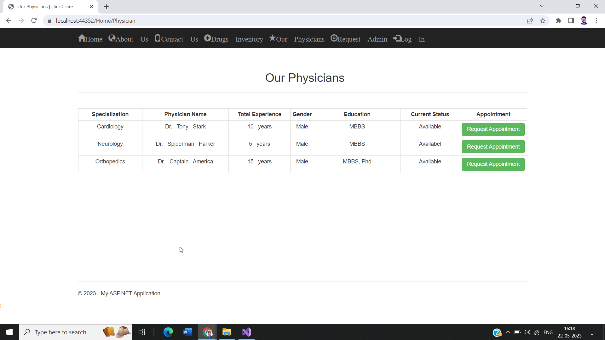

`Login Page`
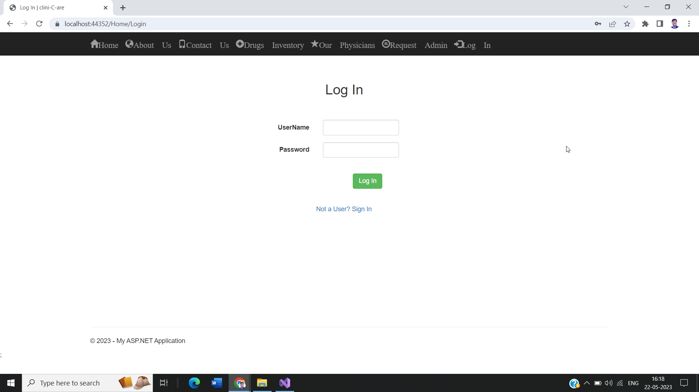

`Admin Home page`
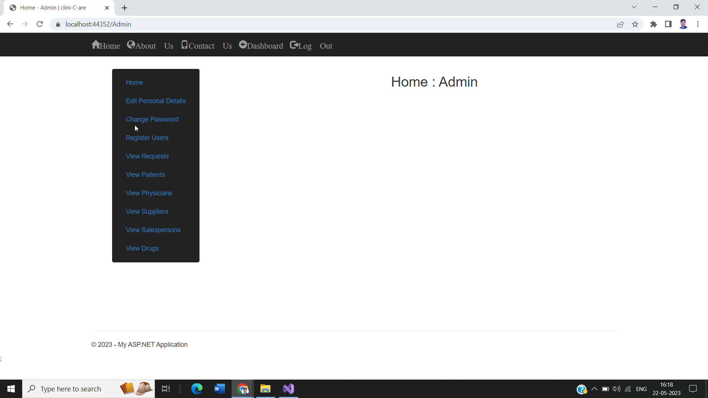

`Registration Page` 
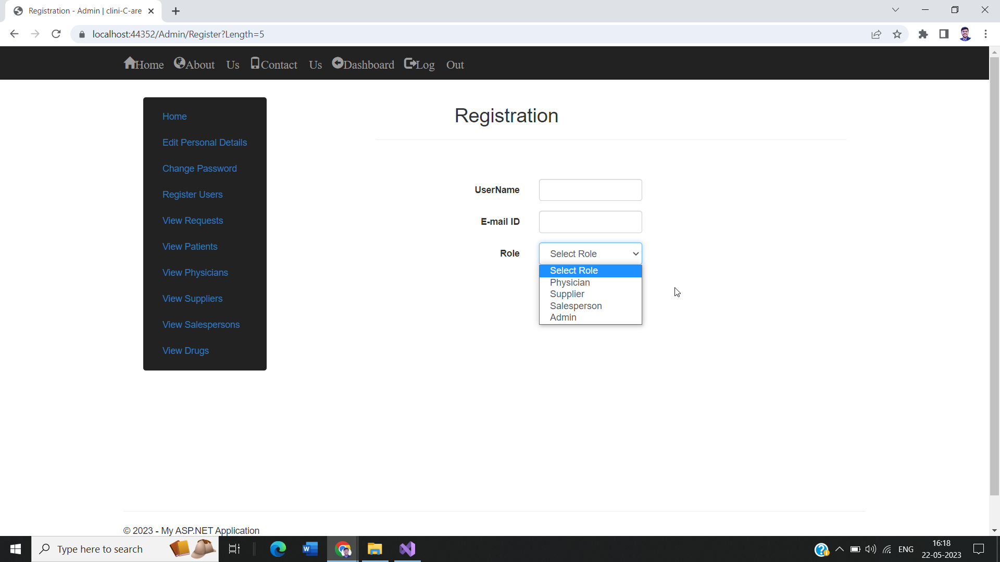

`View Patients page`
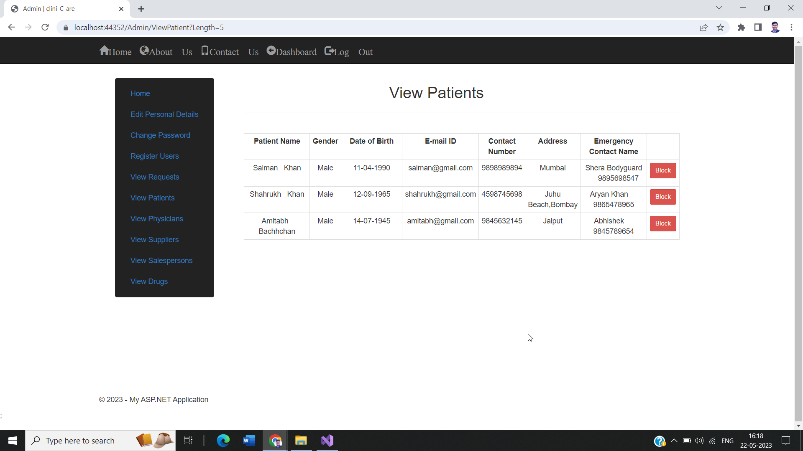

`View Physicians page`
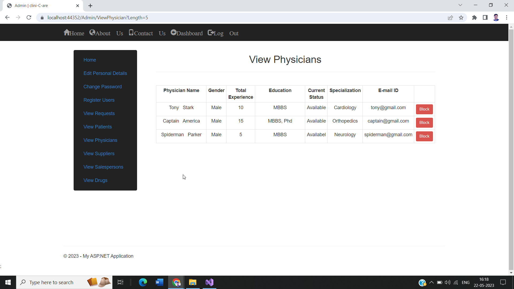

`View Supplier page`


`View Salesperson page`


`View Drug page`
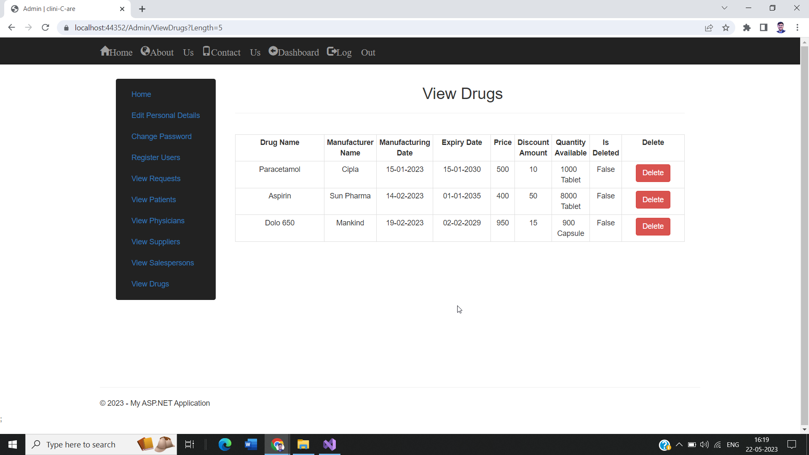

`Edit personal details page`
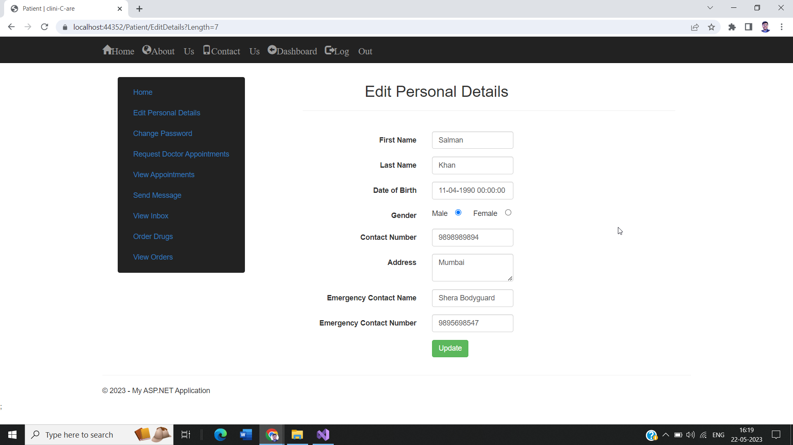

`Request Doctor Appointment page for Patient`


`View Appointment page for Patient`
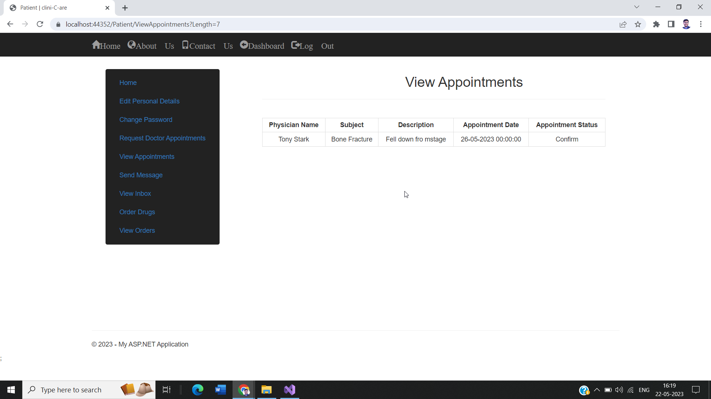

`Order drugs page for Patient `


`View Orders page for Patients`
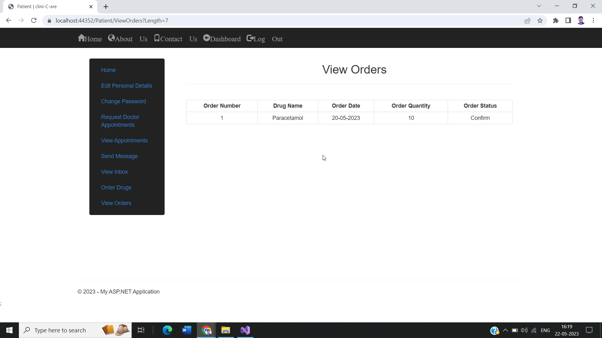

`Physicians Home page`


`View Appointment page for Physicians`
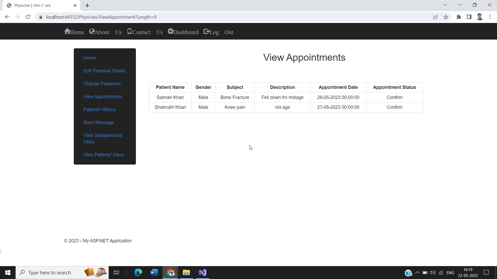

`Edit Physicians Personal details`
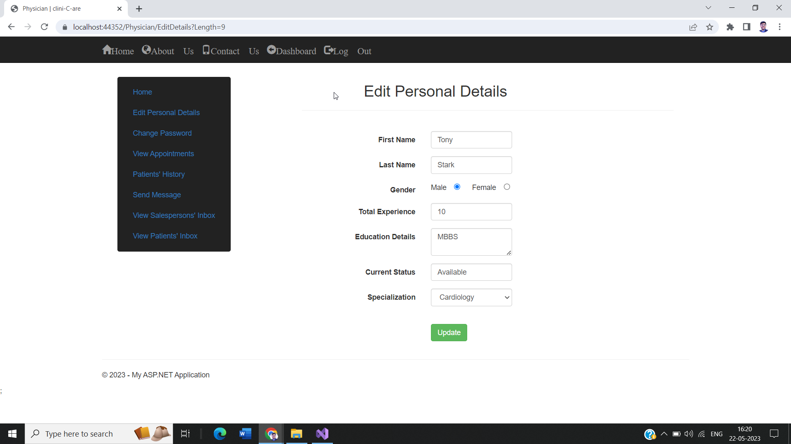

`Supplier Home page`


`Suppliers orders page`
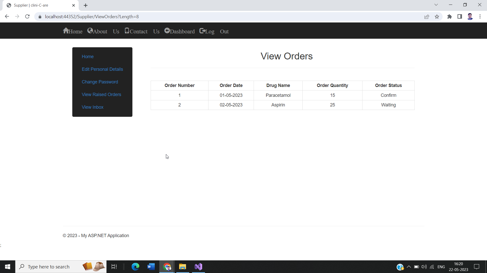

`Salesperson Home page`
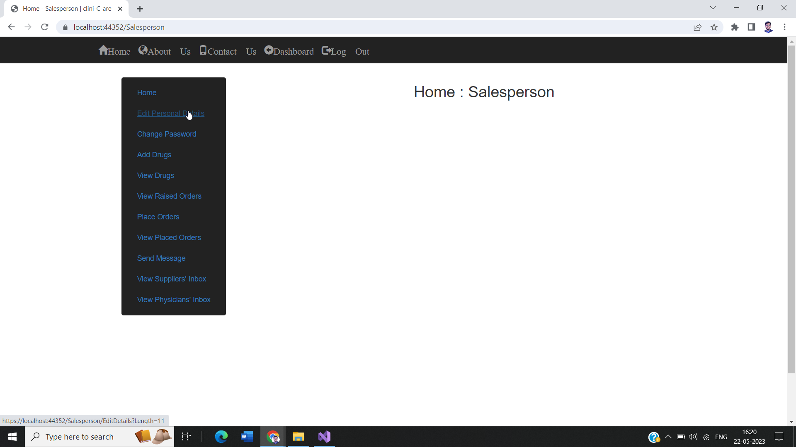

`Salesperson Add  drugs page `
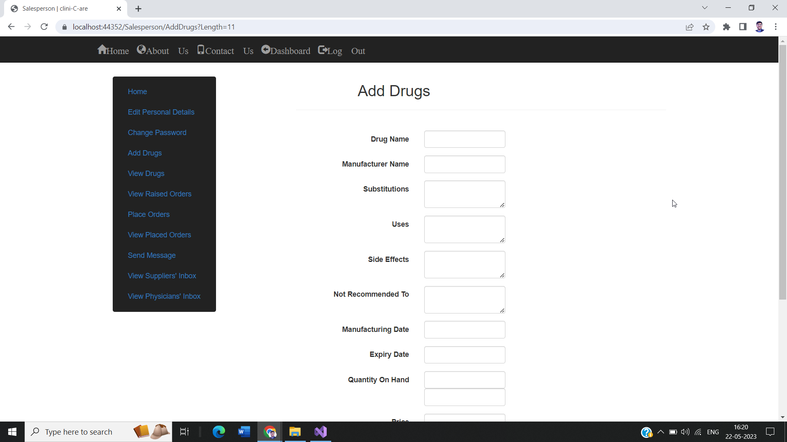

`Salesperson View drugs page`


`Salesperson View order page`
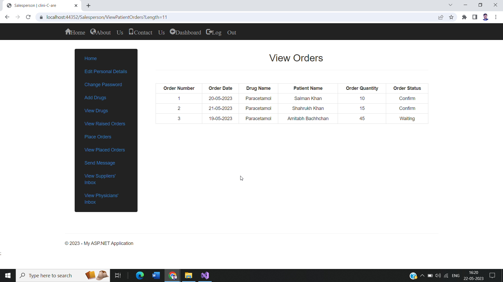

`Request Admin page`


## How to run🔥
1- Install the following:

-   [Microsoft Visual Studio](https://visualstudio.microsoft.com/vs/community/)
-   [Microsoft SQL Server Express](https://www.microsoft.com/en-us/sql-server/sql-server-editions-express)
-   [Microsoft SQL Server Management Studio (SSMS)](https://docs.microsoft.com/en-us/sql/ssms/download-sql-server-management-studio-ssms?view=sql-server-2017)

2- Open SQL Server Management Studio and in the "Connect to Database Engine" window type the following:

```
Servername: .\SQLEXRPESS
Authentication: Windows Authentication 
```
3- Now open Schema.sql file in Database Files folder and execute it all.

4- Populate the database with some test data

5- Everything is setup now! You can run the Visual Studio Project by opening Clinic Management System.sln and click run button named IIS Express.


